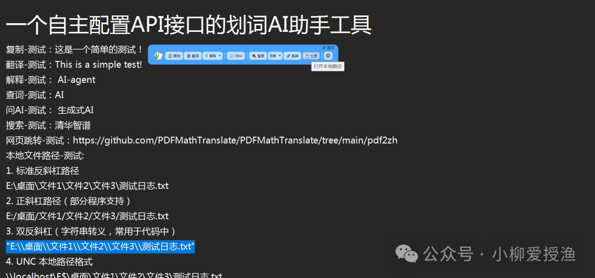
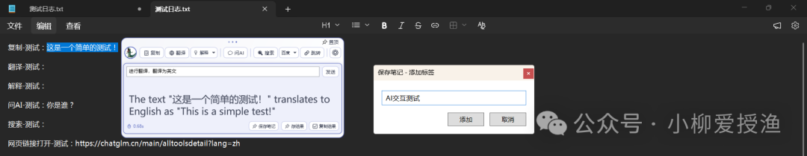
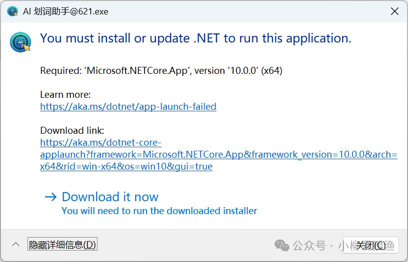
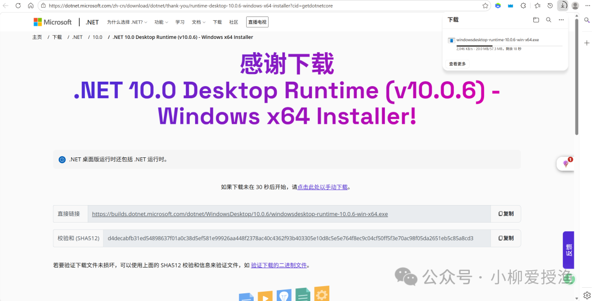
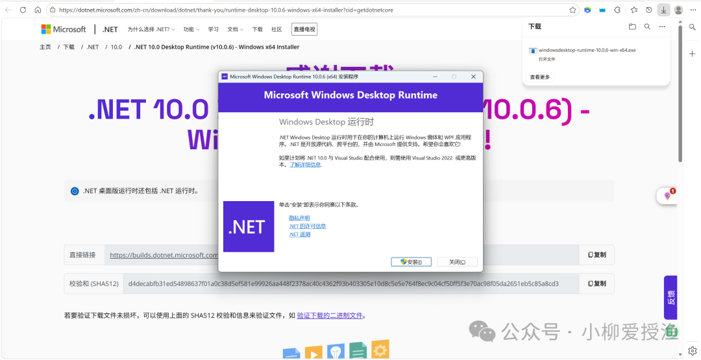
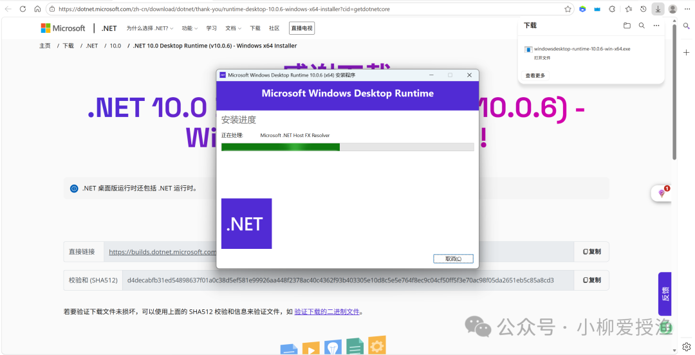
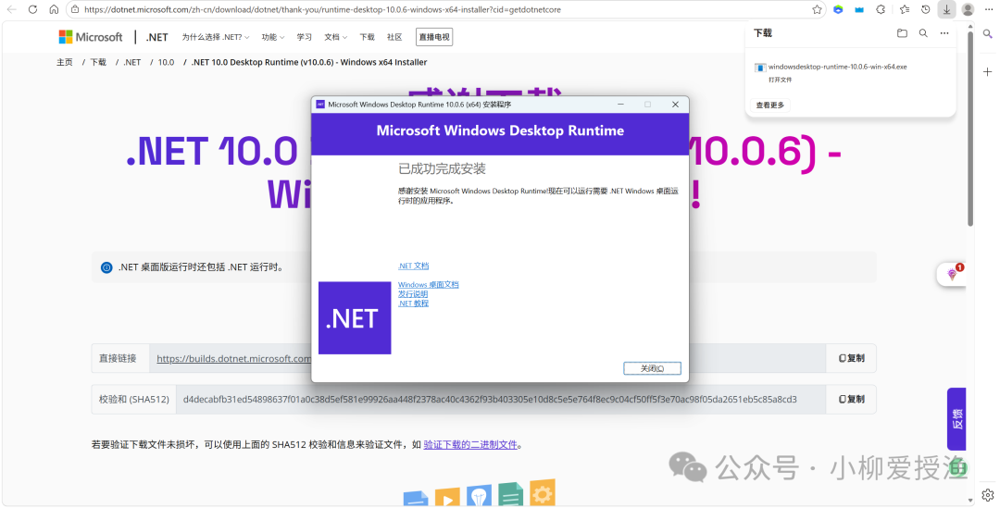
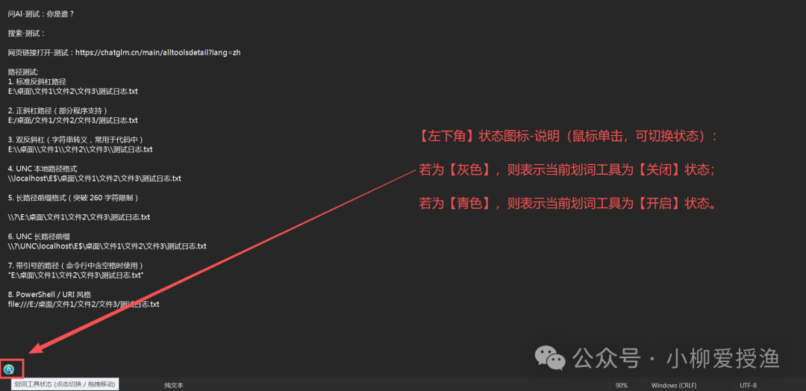

# 个人Windows小工具：AI-划词助手

> 公众号: 小柳爱授渔
> 发布时间: 2026-04-20 16:46
> 原文链接: https://mp.weixin.qq.com/s/Gp0ratRfa0oZbugokPIX2g

---

AI 划词工具栏 · 使用指南

鼠标选中即触发，将翻译、搜索、路径跳转、AI 问答整合进同一入口，告别软件间的频繁切换。

鉴于在日常工作与学习中，翻译、检索、路径跳转等碎片化操作往往分散在多款软件之间，频繁切换消耗大量注意力。本人借助AI工具，开发了一款轻量化的划词工具，旨在将这些高频操作整合于同一入口，做到「划选即触达」。

01 文本处理与翻译

复制 · 翻译 · 解释 ·  查词

**使用说明**

1. 用鼠标在任意界面划选文字，工具栏自动悬浮于选区附近。
2. 点击「**复制**」可替代 “Ctrl+C” 快速拷贝所选内容。
3. 点击「**翻译 / 解释 / 查词**」，工具栏下方即刻展开悬浮面板，AI 返回对应结果，面板自带「复制结果」功能。

**适用场景**

浏览外文网页、阅读英文技术文档或代码注释时，遇到生词直接划词翻译，无需打开第三方翻译软件，保持阅读的连贯性。

02 深入提问与交互

AI 问答  ·  保存结果

**使用说明**

1. 划选一段文字后，点击「**AI 问答**」按钮。
2. 展开面板出现输入框，可针对所选内容直接提问——如「帮我总结这段话的重点」或「解释这段代码的含义」。
3. 获取答案后，通过「**存结果**」或「**复制结果**」将内容留存。

**适用场景**

阅读学术论文或复杂代码时，翻译仍无法理解可快速唤出 AI 做通俗化解释；回复工作邮件时，可选中草稿要求 AI 修正错别字或调整语气。

03 多引擎一键搜索

搜索

**使用说明**

在工具栏设置处可切换搜索引擎，内置以下选项：

- Baidu
- Bing
- Google
- Metaso

划选文字后点击「**搜索**」，即在默认浏览器新建标签页展示查询结果。

**适用场景**

遇到报错代码、陌生专业术语或网络新词，一键直达搜索结果，省去手动唤出浏览器、输入、回车等繁琐操作。

04 路径与网页快速识别

打开网址  ·  打开路径

**使用说明**

**打开网址****：**选中的文本包含合法 HTTP/HTTPS 链接时，点击「跳转」，系统直接调用浏览器跳转至该网址。

**打开路径：**选中的文本为本地文件路径时（例如 “C:\Windows\System32”），点击「位置」，系统自动调用文件管理器并定位至对应目录或文件。

**适用场景**

开发者或运维查看日志文件与配置文件时，经常碰到远程链接和本地绝对路径——划取后一键直达，无需手动复制粘贴到地址栏。

05 随时随地的知识管理

保存笔记

**使用说明**

1. 对翻译、解释、查词、AI 问答的结果，点击「**存结果**」，会弹出添加标签弹窗。
2. 弹出对话框中可为内容打上标签或写下备注，便于后续管理与查阅。
3. 可对勾选已保存的笔记条目进行「**AI 整理与补充**」，实现知识的二次追问与补充。

**适用场景**

碎片化收集翻译、解释与 AI 问答结果，所有划词内容在后台沉淀，形成个人专属小型语料库。

06 个性化排版与显示设置

主题切换  ·  字体缩放

**使用说明**

- **主题切换：** 点击“切换主题”图标，在多个内置主题间无缝切换，界面配色动态随之改变。
- **字号调整：** 面板提供放大 / 缩小按钮，满足不同阅读环境下的视力需求。
- **字体切换：** 支持自由切换「宋体 · 黑体 · 楷体」三种字体族。

**适用场景**

根据不同光线环境切换深色或浅色模式；长文阅读时随时放大结果面板字号，做到不刺眼、不费力。

07 AI 模型 API 接口配置

自主接入 API

**使用说明**

用户可自主接入各大平台的 AI 模型 API。工具内置 **API 连接测试**功能，通过文本输入与发送即可验证配置是否有效，降低上手门槛。

**说明：** 本工具暂时无法免费向用户提供统一的 API 接口，需用户自己前往各大 AI 平台自行注册并申请 API Key，将接口参数填入软件配置界面即可使用。

作者本人所用接口来自 Zotero Garden 插件提供的免费渠道，详见：[每月白嫖 300 万 GPT tokens！Zotero Garden 插件更新](https://mp.weixin.qq.com/s?__biz=MzkyNjUxNjgxNg==&mid=2247484222&idx=1&sn=71b8713fc15a49eb5dd877e0895a4937&scene=21#wechat_redirect)

**免费 API 获取参考渠道：**

[告别 Token 焦虑！AI 免费 API 渠道全攻略（不花钱）](https://mp.weixin.qq.com/s?__biz=MzI5MDM1NTI3Nw==&mid=2247584143&idx=1&sn=4ea7d1fb9cca9495985b6073ce74f731&scene=21#wechat_redirect)

**使用提示：** 如果不希望划词工具栏频繁弹出，可在设置中将触发方式改为「**仅快捷键弹出**」，通过设定专属快捷键按需唤出，减少误触干扰。

08 软件运行问题

**问题说明**

部分用户双击打开「AI 划词助手」时，可能会弹出下面这个提示窗口：

 You must install or update .NET  to run this application.

这是因为该软件基于微软 WPF 框架开发，而 WPF 程序运行需要依赖微软官方提供的 .NET Desktop Runtime（.NET 桌面运行时）。它由微软官方提供，安全可靠，安装一次即可，不会影响电脑性能，也不会弹广告。

**安装步骤（仅需一次）**

1. 点击弹窗中的「Download it now」，浏览器会自动跳转到微软官方下载页

2. 下载完成后，双击运行安装程序，一路点「安装」即可

3. 安装完毕后，重新打开「AI 划词助手」就能正常使用了

💡提示：如果你的电脑上已经安装过其他 .NET 程序（如一些新版 Windows 工具），可能已经自带了这个运行时，就不会出现此提示。

此外，如果划词工具栏未自动弹出，请检查「工具栏状态」图标是否为「青色」。

亦或者，在电脑右下角，单击程序托盘，检查「弹出方式」图标是否为「仅快捷键弹出」。

以上便是这款划词工具栏的基础功能介绍。功能并不繁杂，主要聚焦高频基础需求，尽可能降低日常操作产生的割裂感。

最后，各位读者如有疑问或建议，欢迎评论区留言交流。

工具获取方式：公众号回复【20260420】

**关注**

**小柳爱授渔**

**点击卡片 关注一下**

